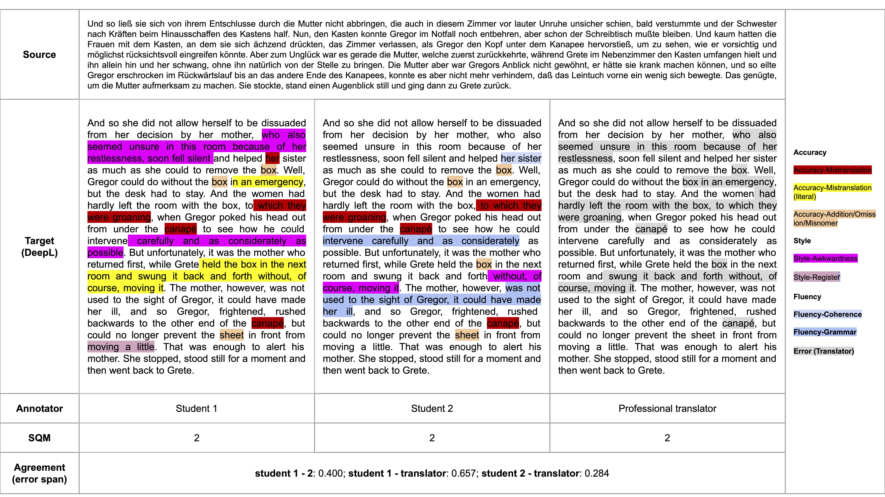

# [How Good Are LLMs for Literary Translation, Really? Literary Translation Evaluation with Humans and LLMs](https://arxiv.org/abs/2410.18697) 

## Quick Links
- [LitEval-Corpus](#)
    - paragraph-level parallel corpus with verified high-quality human translations of both classic and contemporary published works; 9 MT systems including the GPT-4o, commercial models (DeepL and Google Translate), popular LLMs of various sizes (7-8b Llama 3, TowerInstruct, Qwen, Gemma), and older MT systems (M2M, NLLB).
    This dataset is intended for academic purposes only. Use of this dataset requires agreement to the conditions listed in the [form](https://forms.gle/AfyMHiqgfLbp9aA46). The download link will be demonstrated after the form is submitted.      

- [Code for MT generation and evaluation]()
  - [MT generation](#)
  - [MT evlaution](#)

 #### News:
 - 29/Oct/2024: We release student annotation and metric evaluation datasets.  

## LitEval-Corpus:

### Schemes Overview

### Example

